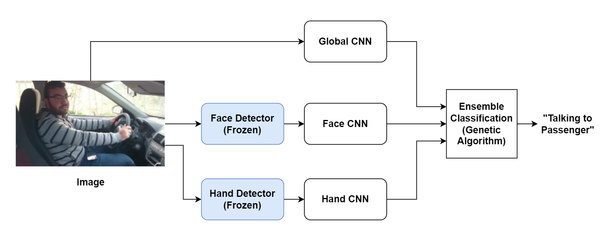

# CyberTruck - Distracted Driver Detection

## Motivation

Developing an AI tool for identifying distracted driving is motivated by the urgent need to enhance road safety. With the escalating incidents of distractions, particularly due to technological devices, leveraging advanced AI, computer vision, and machine learning technologies becomes essential. The goal is to proactively prevent accidents by real-time detection of distracted behaviors, providing immediate alerts to drivers or triggering safety systems. This initiative aligns with evolving regulations, contributes to public awareness, and fosters collaboration for a comprehensive approach to road safety. Ultimately, the AI tool aims to save lives, reduce accidents, and promote responsible driving habits.

## Our work



This model is built upon the foundation laid out in the NeuroIPS 2018 paper, specifically titled "Driver Distraction Identification with an Ensemble of Convolutional Neural Networks." Our team has undertaken the task of replicating this model, introducing certain modifications, and incorporating our unique version of a genetic algorithm.

One notable alteration made by our team involves the adjustment of the number of classifiers, a component originally presented in the referenced paper. This modification was implemented to tailor the model to our specific requirements and potentially enhance its performance.

## Dataset

It is essential to note that the successful implementation of our model relies on obtaining the dataset provided by https://heshameraqi.github.io/distraction_detection. This dataset serves as a crucial resource, enabling us to train and evaluate the model effectively. The utilization of this dataset ensures the model's exposure to diverse real-world scenarios, contributing to its robustness and efficacy in identifying driver distractions. Place dataset inside of the ``data`` folder.


## Installation

The code requires `python>=3.8`, as well as `pytorch>=1.7` and `torchvision>=0.8`. Please follow the instructions [here](https://pytorch.org/get-started/locally/) to install both PyTorch and TorchVision dependencies. Installing both PyTorch and TorchVision with CUDA support is strongly recommended.

To install Cybertruck and its depenencies, we strongly recommend the use of a package manager like conda:

```
git clone cap6411-cybertruck/cybertruck
conda create -n cyber python=3.10
conda activate cyber
pip install -r requirements.txt
```
# Repo setup

- `detection` - Contains all the python files for the detection models
  - `face_detection` code pertaining to detecting facial features.
  - `hands_detection` code pertaining to detecting hand features.
- `cnn` - Contains all of the code for the different CNNs in our ensemble, including the ``main.py`` and ``train_val.py``, which setup the models, training and validation.
- `ensemble.py` - Contains the ensemble and code for running it.
- `experiments` and `ensemble_experiments` contain some of the different configurations we attempted in search of the best results.

## Model Weights
The weights to our CNNs and detectors can be found [here](https://drive.google.com/drive/folders/1MagVo90UdXyrd3A_9Ait3j8vE531fe-9?usp=sharing).

Create three folders under the ``cnn`` directory and save the respective CNN weights there:

```
mkdir face_models hands_models raw_models
```

Save your detector weights in the ``detection`` folder, under their respective detection subfolders.


# Training Individual CNNs

To train any of our individual CNNs, run the following script. Certain arguments like ``--detector_path`` are not necessary to train the Raw CNN. For a list of all of the available arguments, please refer to the argument parser in ``cnn/main.py``.

```
python cnn/main.py --model <model_to_train> --detector_path <path_if_necessary> --optimizer SGD
```

# Training the Ensemble

You can train the ensemble with by running the script:

```
python ensemble.py --train --face_detector_path <path_to_detector> --hands_detector_path <path_to_detector> 
--raw_cnn_path <path_to_cnn> --hands_cnn_path <path_to_cnn> --face_cnn_path <path_to_cnn>
--pop_size <int_value> --num_gens <int_value> --save_folder <folder_to_store_results>
```

The genetic algorithm needs many iterations to learn the best weights. As such, we encourage to set ``--pop_size`` to at least ``20`` and ``--num_gens`` to at least ``10``. Depending on your GPU, you may need to lower the ``--batch_size`` from the default ``64`` to a value like ``16``. 

# Validation

To validate your results:

```
python ensemble.py --face_detector_path <path_to_detector> --hands_detector_path <path_to_detector> 
--raw_cnn_path <path_to_cnn> --hands_cnn_path <path_to_cnn> --face_cnn_path <path_to_cnn>
```


# Contributors

CAP6411 Fall 2023 - Group 6   
Ron, Robin, Suneet, Osi, Kasun

